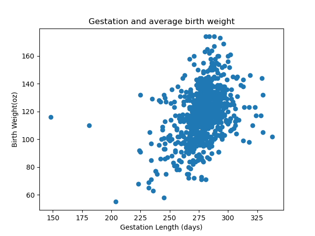

# Mini Project 3: Generating Descriptive Statistics with Polars
##### The goal of this project is to utilize the polars library to create summary statistics and visualizations for a data set
---
#### Requirements:

- [X] Python script using Polars for descriptive statistics
- [X] Read a dataset (CSV or Excel)
- [X] Generate summary statistics (mean, median, standard deviation)
- [X] Create at least one data visualization
- [X] Python script 
- [X] CI/CD with badge
- [X] Generated summary report (PDF or markdown) via CI/CD for extra credit or making your own PDF or MD file and pushing it 
---
### Workflow Summary and Explanation
##### This project contains the following dependencies:
- pylint 
- black
- pytest
- polars
- matplotlib
    
---
### Descriptive Statistics Table
---
###### The following table is the main.py output, indicating the count, mean, std, min, quartiles, and max for the numeric variables

| statistic | id       | date     | gestation  | … | mht     | mpregwt | inc     | smoke   |
|---------- |----------|----------|---------- |---|---------|---------|---------|---------|
| count     | 869.0    | 869.0    | 869.0     | … | 869.0   | 869.0   | 869.0   | 869.0   |
| null_cou  | 0.0      | 0.0      | 0.0       | … | 0.0     | 0.0     | 0.0     | 0.0     |
| nt        |          |          |           |   |         |         |         |         |
| mean      | 6032.418 | 1536.423 | 278.5074  | … | 64.0690 | 128.478 | 3.68124 | 0.46375 |
|           | 872      | 475      | 8         |   | 45      | 711     | 3       | 1       |
| std       | 2241.559 | 106.9506 | 15.69896  | … | 2.53361 | 20.7784 | 2.28466 | 0.49897 |
|           | 842      | 55       | 8         |   | 2       | 24      | 7       | 1       |
| min       | 15.0     | 1350.0   | 148.0     | … | 53.0    | 87.0    | 0.0     | 0.0     |
| 25%       | 5477.0   | 1444.0   | 272.0     | … | 62.0    | 113.0   | 2.0     | 0.0     |
| 50%       | 6734.0   | 1540.0   | 279.0     | … | 64.0    | 125.0   | 3.0     | 0.0     |
| 75%       | 7587.0   | 1627.0   | 286.0     | … | 66.0    | 140.0   | 5.0     | 1.0     |
| max       | 9263.0   | 1714.0   | 338.0     | … | 72.0    | 220.0   | 9.0     | 1.0     |

---
### Visualizations
---
###### The following graph is a visualization created by the script, which displays the average birth weight compared to the length of the mother's gestation:

